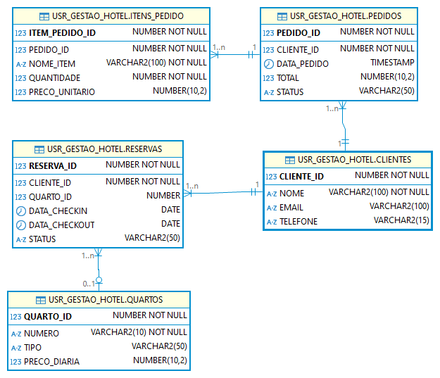

<h1>DOCUMENTAÇÃO DO GERENCIADOR DE HOTEL E RESTAURANTE</h1>

<h2>Desafio Proposto</h2>



<h3>PRINCIPALIDADES PARA MODELAGEM DDL</h3>
Primeiramente para gerenciar um banco de dados precisamos de uma sequencia de itens para nos auxiliar como sequences para gerar ids, usuários para ler e criar e modelar bases de dados.

**Scripts de criação de `SEQUENCES` e de `usuario`**

```sql
ALTER SESSION SET "_ORACLE_SCRIPT" = true;

CREATE USER usr_gestao_hotel IDENTIFIED BY gestao_hotel
    DEFAULT TABLESPACE users
    TEMPORARY TABLESPACE temp;
    
GRANT connect, resource TO usr_gestao_hotel;

ALTER USER usr_gestao_hotel QUOTA UNLIMITED ON USERS;

CREATE SEQUENCE seq_itens_pedido START WITH 1 INCREMENT BY 1;
CREATE SEQUENCE seq_pedidos START WITH 1 INCREMENT BY 1;
CREATE SEQUENCE seq_clientes START WITH 1 INCREMENT BY 1;
CREATE SEQUENCE seq_reservas START WITH 1 INCREMENT BY 1;
CREATE SEQUENCE seq_quartos START WITH 1 INCREMENT BY 1;

```

<br>

**Criando a Tabela `clientes`**

Precisamos seguir o modelo nos passado então vamos criar a tabela de clientes da forma mais fidedigna possível utilizando as sequences criadas acima.

```sql
CREATE TABLE clientes (
    cliente_id NUMBER DEFAULT seq_clientes.NEXTVAL PRIMARY KEY,
    nome VARCHAR2(100) NOT NULL,
    email VARCHAR2(100),
    telefone VARCHAR2(15)
);
```
**FORMAÇÃO DA TABELA DE CLIENTES**

| VARIAVEL       | TIPO | DESCRIÇÃO        |
|-----------|------|---------------|
| cliente_id       | numérico    | é um identificador de cliente     |
| nome      | texto    | representa o nome do cliente |
| email      | texto    | representa o email do cliente |
| telefone      | texto    | representa o telefone de contato do cliente |

<br>

**Criando a Tabela `quartos`**

Precisamos seguir o modelo nos passado então vamos criar a tabela de quartos da forma mais fidedigna possível utilizando as sequences criadas acima.

```sql
CREATE TABLE quartos (
    quarto_id NUMBER DEFAULT seq_quartos.NEXTVAL PRIMARY KEY,
    numero VARCHAR2(10) NOT NULL,
    tipo VARCHAR2(50),
    preco_diaria NUMBER(10, 2)
);
```
**FORMAÇÃO DA TABELA DE QUARTOS**

| VARIAVEL       | TIPO | DESCRIÇÃO        |
|-----------|------|---------------|
| quarto_id       | numérico    | é um identificador do quarto     |
| numero      | texto    | representa o numero do quarto |
| tipo      | texto    | representa o tipo do quarto |
| preco_diaria      | numérico    | representa o preço cobrado diariamente de estadia do cliente |

<br>

**Criando a Tabela `reservas`**

Precisamos seguir o modelo nos passado então vamos criar a tabela de reservas da forma mais fidedigna possível utilizando as sequences criadas acima.

```sql
CREATE TABLE reservas (
    reserva_id NUMBER DEFAULT seq_reservas.NEXTVAL PRIMARY KEY,
    cliente_id NUMBER NOT NULL,
    quarto_id NUMBER,
    data_checkin DATE,
    data_checkout DATE,
    status VARCHAR2(50), 
    CONSTRAINT fk_cliente_reservas FOREIGN KEY (cliente_id) REFERENCES clientes(cliente_id) ON DELETE CASCADE,
    CONSTRAINT fk_quarto FOREIGN KEY (quarto_id) REFERENCES quartos(quarto_id) ON DELETE CASCADE
);
```
**FORMAÇÃO DA TABELA DE RESERVAS**

| VARIAVEL       | TIPO | DESCRIÇÃO        |
|-----------|------|---------------|
| reserva_id       | numérico    | é um identificador de reserva    |
| cliente_id      | numérico    | representa o numero do id do cliente que reservou |
| quarto_id      | numérico    | representa o numero do id do quarto reservado |
| data_checkin      | data    | representa a data do check in |
| data_checkout      | data    | representa a data do check out |
| status      | texto    | representa o status da reserva |

| CONSTRAINTS       |  DESCRIÇÃO        |
|-----------|---------------|
| fk_cliente_reservas       |  no caso da deleção de um cliente é deletada a reserva    |
| fk_quarto      |  no caso da deleção de um quarto é deletada a reserva |

<br>

**Criando a Tabela `pedidos`**

Precisamos seguir o modelo nos passado então vamos criar a tabela de pedidos da forma mais fidedigna possível utilizando as sequences criadas acima.

```sql
CREATE TABLE pedidos (
    pedido_id NUMBER DEFAULT seq_pedidos.NEXTVAL PRIMARY KEY,
    cliente_id NUMBER NOT NULL,
    data_pedido TIMESTAMP, 
    total NUMBER(10, 2), 
    status VARCHAR2(50), 
    CONSTRAINT fk_cliente_pedidos FOREIGN KEY (cliente_id) REFERENCES clientes(cliente_id) ON DELETE CASCADE
);
```
**FORMAÇÃO DA TABELA DE PEDIDOS**

| VARIAVEL       | TIPO | DESCRIÇÃO        |
|-----------|------|---------------|
| pedido_id       | numérico    | é um identificador do numero do pedido    |
| cliente_id      | numérico    | representa o numero do id do cliente que realizou o pedido |
| data_pedido      | data    | representa a data e hora do pedido |
| total      | numérico    | representa o valor total do pedido |
| status      | texto    | representa o pedido |

| CONSTRAINTS       |  DESCRIÇÃO        |
|-----------|---------------|
| fk_cliente_pedidos       |  no caso da deleção de um cliente é deletado o pedido    |

<br>

**Criando a Tabela `itens_pedido`**

Precisamos seguir o modelo nos passado então vamos criar a tabela de itens_pedido da forma mais fidedigna possível utilizando as sequences criadas acima.

```sql
CREATE TABLE itens_pedido (
    item_pedido_id NUMBER DEFAULT seq_itens_pedido.NEXTVAL PRIMARY KEY,
    pedido_id NUMBER NOT NULL,
    nome_item VARCHAR2(100) NOT NULL,
    quantidade NUMBER NOT NULL, 
    preco_unitario NUMBER(10, 2), 
    CONSTRAINT fk_pedido FOREIGN KEY (pedido_id) REFERENCES pedidos(pedido_id) ON DELETE CASCADE
);
```
**FORMAÇÃO DA TABELA DE ITENS_PEDIDO**

| VARIAVEL       | TIPO | DESCRIÇÃO        |
|-----------|------|---------------|
| item_pedido_id       | numérico    | é um identificador de um item dentro de um pedido    |
| pedido_id      | numérico    | representa o numero do id do pedido relacionado ao item |
| nome_item      | texto    | representa nome do item do pedido |
| quantidade      | numérico    | representa o total do item dentro do pedido |


| CONSTRAINTS       |  DESCRIÇÃO        |
|-----------|---------------|
| fk_pedido       |  no caso da deleção de um pedido é deletado o item relacionado a pedido    |

Por fim damos um `commit` para sincronizar com a base.
```sql
COMMIT;
```

<h3>PRINCIPALIDADES PARA DESENHO DE DML</h3>
Primeiramente para utilizar o schema de dml é necessário entender que deve ser rodado de cima para baixo seguindo a ordem a qual foi escrito e no fim damos commit para sincronizar a base.

```sql
-- Inserir clientes
INSERT INTO clientes (nome, email, telefone) VALUES ('João Silva', 'joao.silva@gmail.com', '123456789');
INSERT INTO clientes (nome, email, telefone) VALUES ('Maria Oliveira', 'maria.oliveira@hotmail.com', '987654321');
INSERT INTO clientes (nome, email, telefone) VALUES ('Carlos Souza', 'carlos.souza@yahoo.com', '456123789');

-- Inserir quartos
INSERT INTO quartos (numero, tipo, preco_diaria) VALUES ('101', 'Standard', 200.00);
INSERT INTO quartos (numero, tipo, preco_diaria) VALUES ('102', 'Deluxe', 350.00);
INSERT INTO quartos (numero, tipo, preco_diaria) VALUES ('103', 'Suite', 500.00);

-- Inserir reservas
INSERT INTO reservas (cliente_id, quarto_id, data_checkin, data_checkout, status) 
VALUES (1, 1, TO_DATE('2024-12-10', 'YYYY-MM-DD'), TO_DATE('2024-12-15', 'YYYY-MM-DD'), 'Confirmada');

INSERT INTO reservas (cliente_id, quarto_id, data_checkin, data_checkout, status) 
VALUES (2, 2, TO_DATE('2024-12-12', 'YYYY-MM-DD'), TO_DATE('2024-12-14', 'YYYY-MM-DD'), 'Pendente');

INSERT INTO reservas (cliente_id, quarto_id, data_checkin, data_checkout, status) 
VALUES (3, 3, TO_DATE('2024-12-11', 'YYYY-MM-DD'), TO_DATE('2024-12-18', 'YYYY-MM-DD'), 'Confirmada');

-- Inserir pedidos
INSERT INTO pedidos (cliente_id, data_pedido, total, status) 
VALUES (1, TO_TIMESTAMP('2024-12-11 15:00:00', 'YYYY-MM-DD HH24:MI:SS'), 150.00, 'Pago');

INSERT INTO pedidos (cliente_id, data_pedido, total, status) 
VALUES (2, TO_TIMESTAMP('2024-12-12 18:30:00', 'YYYY-MM-DD HH24:MI:SS'), 200.00, 'Pendente');

INSERT INTO pedidos (cliente_id, data_pedido, total, status) 
VALUES (3, TO_TIMESTAMP('2024-12-13 12:00:00', 'YYYY-MM-DD HH24:MI:SS'), 300.00, 'Pago');

-- Inserir itens de pedidos
INSERT INTO itens_pedido (pedido_id, nome_item, quantidade, preco_unitario) 
VALUES (1, 'Jantar', 2, 50.00);

INSERT INTO itens_pedido (pedido_id, nome_item, quantidade, preco_unitario) 
VALUES (1, 'Bebida', 2, 25.00);

INSERT INTO itens_pedido (pedido_id, nome_item, quantidade, preco_unitario) 
VALUES (2, 'Café da manhã', 1, 50.00);

INSERT INTO itens_pedido (pedido_id, nome_item, quantidade, preco_unitario) 
VALUES (3, 'Almoço', 2, 150.00);

INSERT INTO itens_pedido (pedido_id, nome_item, quantidade, preco_unitario) 
VALUES (3, 'Sobremesa', 2, 75.00);

COMMIT;
```

Muito obrigado por ler :) abaixo se segue os participantes:

| NOME       | RA | EMAIL        |
|-----------|------|---------------|
| Felipe Knöner Trigo | 182673 | felipeknonertrigo@gmail.com |
| Pedro Ronaldo Moreira Travessin | 182409 | pedromtravessin@gmail.com |
| Vitória kamizono | 192132 | vivi.kamizono@gmail.com |
